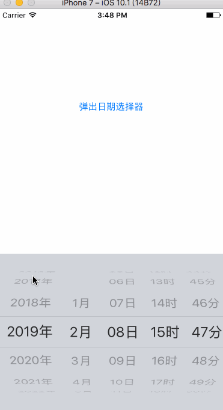

# RDatePicker
RDatePicker

## preview

 
 
## use

```
 //触发弹出日历选择器
 [self.textField becomeFirstResponder];
```

```
 //懒加载 初始化一个UITextField 把UITextField的inputView设置成 RDatePicker
 - (UITextField *)textField {
    if (_textField == nil) {
        RDatePicker *pickview = [[RDatePicker alloc]init];
        pickview.frame = CGRectMake(0, 0, [UIScreen mainScreen].bounds.size.width, 260);
        pickview.complete = ^(NSInteger minute,NSInteger hour, NSInteger day, NSInteger month, NSInteger year, NSDate *date){
            NSLog(@"%@",date);
        };
        _textField = [[UITextField alloc] init];
        _textField.inputView = pickview;
        //_textField.inputAccessoryView = self.accessoryView;
        [self.view addSubview:_textField];
    }
    return _textField;
}

//点击键盘外区域关闭弹出view
- (void)touchesEnded:(NSSet *)touches withEvent:(UIEvent *)event {
    if (![self.textField isExclusiveTouch]) {
        [self.textField resignFirstResponder];
    }
}
```
 
## TODO
* 每个月的天数按照月份计算
* 添加取消和确定的按钮
* 增加选择时间后的返回值
